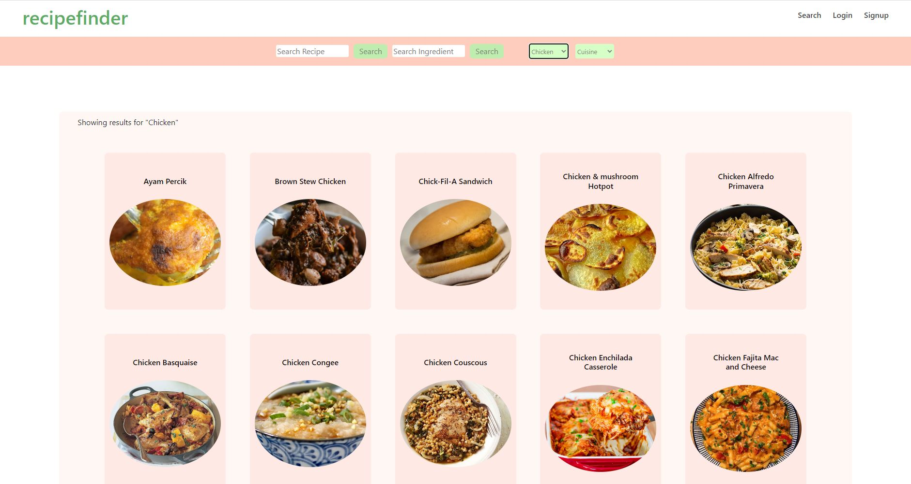

# Recipe Finder

[RecipeFinder](https://k-meal-planner.herokuapp.com/)

## Overview

Recipe Finder is a full-stack MERN (MongoDB, Express, React, Node.js) web application that allows users to search and save recipes. The app also allows users to add recipe ingredients to a shopping cart and either order groceries or email a shopping list.

## Features

-User can search for recipes using keywords, ingredients or cuisine.
-User can create an account and save recipes for future reference.
-User can add recipe ingredients to a shopping cart or shopping list.
-User can choose to order groceries or email a shopping list.
-User can view the nutrition information for a recipe.

## Installation

To run the app locally, clone the repository and navigate to the root directory. Install dependencies using npm install.

You will also need to create a .env file in the root directory and set the following environment variables:

## Technologies Used

-MongoDB  
-Express  
-React  
-Node.js  
-JWT  
-Bootstrap / React Bootstap / Icons  
-Stripe  
-Custom CSS  
-GraphQL  
-env-cmd (Protect sensitive key information on the client side)  
-API call from TheMealDB  

## Screenshots

## Contributors

[Michelle Tran](https://github.com/michelletrn) 
[Peter Lim](https://github.com/peterlim995) 
[Justin Yi](https://github.com/inputName-jy) 
[Thomas Maly](https://github.com/ThomasJay44)
 
## Acknowledgements

-This project was inspired by all those recipe websites that have complete life stories of the writer inserted into the page rather than getting right to the info you want.